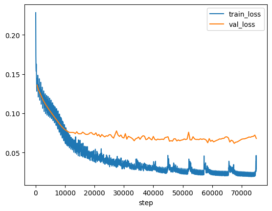

# Amodal completion with transformers   
 

## Description  

An experiment to see if we can train [ViT](https://arxiv.org/abs/2010.11929) to output amodally completed shape. Amodal completion is a perceptual phenomenon where shapes occluded by other shapes appear to us as complete. For instance, if a disk occludes part of a rectangle, we still perceive that rectangle as a rectangle rather than some odd shape that has a small portion missing.

Here we hypothesize that training a ViT to output full shapes that are behind an occluder (these are our targets that a model is learning to predict) is a sufficient signal to learn amodal completion. Caveat -– only rectangles and discs used, so our results may not generalize to more complex scenes.

This ViT implementation is based on [PyTorch Lightning Tutorial 11](https://pytorch-lightning.readthedocs.io/en/stable/notebooks/course_UvA-DL/11-vision-transformer.html).


## How to run   

1. Install dependencies   

    ```bash
    # clone project   
    git clone https://github.com/qbilius/amodal

    # install project   
    cd amodal 
    pip install -e .   
    pip install -r requirements.txt
    ```   

2. Run training locally: `python amodal/train.py`.
3. Observe results with tensorboard: `tensorboard --logdir=output`.
4. Visualize loss with `python amodal/visualization.py plot_loss --version <version number>`.
5. Visualize amodal completion results with `python amodal/visualization.py plot_results --version <version number>`.

## Details

- Architecture:
  - Image embedding into a 64-dimensional space
  - Positional encoding, sampled from a normal distribution
  - 4 transformer layers with 128-dimensional hidden layers
  - A final fully-connected prediction layer that de-embeds outputs back into an image space
- Optimizer: SDG with learning rate = .1 and momentum .9
- Training: 150 training epochs on a dataset of 50k examples (~2 hours)


## Results

[Checkpoint](https://github.com/qbilius/amodal/releases/download/v1.0.0/last.ckpt) - [Parameters](https://github.com/qbilius/amodal/releases/download/v1.0.0/hparams.yaml) - [Log](https://github.com/qbilius/amodal/releases/download/v1.0.0/events.out.tfevents)




## License

MIT